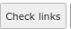
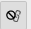

.. include:: /Includes.rst.txt

.. _linkChecking:

=================
Link checking
=================

.. _linkCheckingOnTheFly:

When link checking is done
==========================

#. Via console command (or scheduler), a full link check of the entire sites or
   specific pages can be performed

#. "on-the-fly" checking: When editing a record by pressing the blue "edit" action
   button |edit_action_image| in the list of broken links, a recheck is performed
   when returning to the list. This only checks the links in the edited field.

#. If records or pages are deleted or set to inactive (hidden=1), the
   corresponding broken link records are removed immediately.

#. It is possible to manually start (re)checking by pressing the "Check links"
   button |check_links_button_image| in the list. This will check all links on
   the current page and subpages (depending on the selected depth, e.g. 2 levels).
   This is by default not active for editors (to avoid excessive rechecking),
   but can be configured to be available.

#. It is possible to recheck the current link by pressing the "Recheck URL"
   button. |recheck_url_action_image| This is faster than the previous option and can
   be useful, if only a few broken link records need to be rechecked.

It is recommended to configure the console command to perform a full check
regularly (e.g. once a day).

Due to normal editing activity some of the broken link information can become
outdated between the full checks, which can be handled either with the "Recheck URL"
button (for recheck for one broken link) or with the "Check links" button to
check an entire page or page and subpages.

The fifth option (Recheck URL) is the only action where the link target cache
is not used. This can be used to refresh the information about the link target.

What is checked
===============

By default, links are not checked on hidden records or records on hidden pages.
In general, if content is not rendered in the frontend, it does not make sense
to check the content. Thus, the following are also not checked:

*  Content on pages with page type "Shortcut" or "Link to external URL".
*  Content of default language on pages with the option "Hide default language
   of page" enabled
*  Subpages or content on subpages of a hidden page with "Extend to subpages"
   enabled
*  Content in a hidden gridelement

Link target cache
=================

In general, we try to avoid excessive checking, especially when it comes
to external URLs.

Checking external URLs has the following problems:

*  network traffic is generated
*  external sites may be bombarded with requests in rapid succession -
   in general it is recommended to wait between requests to the same site (crawl delay).
   If external sites get too many requests (in a timeframe), this may even
   result in our site getting blocked.
*  checking an external URL may take a few seconds to complete - redirects
   are followed, which may result in several requests and each single
   request may take several seconds - thus, it is undeterministic. Using this
   mechanism for on-the-fly checking is problematic, because we want to obtain
   the results immediately.

For this reason, the following mechanisms are used:

*  The results of external link checking is cached. This means, if an
   URL is checked more than once before the cache expires, the results
   from the cache are used.
*  Crawl delay, see next section.

This has the drawback, that the broken link information may be outdated, because
the link target has changed its status.

However, the advantages are that link checks are faster and less external link
checking is performed.

If information about an external URL is outdated, the recheck URL
button |recheck_url_action_image| can be used to refresh.

This will recheck the URL and also update all other broken
link records, if the link target status changed.

Crawl delay
===========

If several URLs of one domain are checked, we wait at least this amount of
time before the next request (this is only done when checking via the console
command, not for on-the-fly checking).

.. _howItWorksExcludeLinkTargets:

Exclude link targets
====================

It is a known problem, that the automatic checking does not always yield the
correct result, specifically the link is shown as broken, but it works (e.g.
by checking in the browser). These are known as "false positives". This is
rare but may happen for a handful of different URLs in your site.

As a workaround, it is possible to add a specific URL or specific domain to an
exclude list. In this case, the URL will be treated as if valid. It will no
longer show up in the report. As soon as the URL is excluded, all existing
broken link records are removed. Adding an URL to the exclude list can be
conveniently done by clicking on a button |exclude_link_target_action_image|
in the list of broken links.

For more information about the usage see :ref:`usage_exclude_link_targets`.

