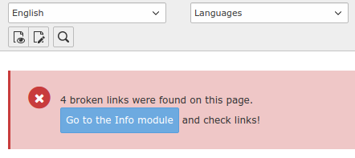

.. include:: ../Includes.txt

.. _installation:

============
Installation
============

If you are using Composer, you can install it like any other extension.

.. code-block:: shell

   composer require sypets/brofix

If you are not using Composer, you can install Broken Link Fixer
(brofix) using the Extension Manager.

page_callouts
=============

It is recommended to install the extension **page_callouts** as well, as it
will supply the hook / event to show information about broken links
in the page module.

   Page module with information about broken links and link to broken link list.

Installation of page_callouts

.. code-block:: shell

   composer require sypets/page-callouts
