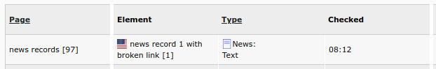
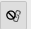

.. include:: /Includes.rst.txt

.. _usageQuickstart:

================
Usage quickstart
================

.. rst-class:: bignums-xxl

#. Switch to the broken link list

   When you see the message "Broken links were found" in the page module, click
   on the link that is displayed.

   .. image:: ../_images/message_broken_links_were_found.png
      :class: with-shadow

   You will now see the list of broken links.

   Alternatively, select "Check Linnks" in the left column.

#. Start editing

   Click on the "Edit" action button |edit_action_image| for one of the items in
   the list.

#. Fix the link

   In the rich text editor (RTE), the broken link should stand out (with yellow
   background and red border).

   .. image:: ../_images/rte_broken_link.png
      :class: with-shadow

   Double click on it and the link browser will open.

   If the broken link is not in an RTE field, you may have to directly edit
   the field.

   .. image:: ../_images/edit_header_link.png
      :class: with-shadow

In general, broken link fixing is pretty straightforward, but there are some
pitfalls which you may run into sooner or later. Look at :ref:`usagePitfalls`
for some tips on how to deal with these.

The report
==========

This section covers some more details of the list of broken links.

depth selector
--------------

What Broken Link Fixer will show depends on the currently selected page
(in the page tree). Additionally, you can show broken link information on
subpages. This depends on the depth, that is selected:

*  **This page**: shows only broken links on current page
*  **1 level**: shows broken links on current page and direct subpages of this page
*  **2 levels**: additionally show broken links on subpages of the subpages
*  etc.

This is the same behaviour as in the "Pagetree Overview", also in the Info
module.

Using a high level (e.g. "infinite") may be useful for getting an overview. But,
depending on the number of pages and broken links found, working with this may
feel sluggish and slow. It is recommended to use a low level when working with
the list (e.g. "This page").

buttons
-------

*  **Refresh display**: This just reloads the list. It does not recheck links.
*  **Check links** (if available): This checks broken links, depending on the
   selected depth. For external URLs, the :ref:`usagePitfallsLinkTargetCache`
   is used.
*  **i** (if configured): This opens the documentation in another browser tab.

table
-----

Columns in the table:

   Columns 1-3

1. **Page**: The title and [page id] are shown.

2. **Element**: The record in which the broken link was found in. A language icon
   may be displayed. The header of the element (if available) and the [uid]
   are displayed.

3. **Type**: This shows the type of the record (e.g. "Page Content", "Page", "News")
   and the field the broken link is found in (e.g. "Text", "Link").

   Columns 5-8

5. **Link target**: The link target (e.g. the URL or target page). You can click
   on it, to open it in another browser tab.

6. **Error**: The error that occurred, e.g. "Page not found". Hover over the
   text with the mouse to see the original exception message.

7. **Checked**: The last check time of the **link target** or when the
   element was last checked (whichever is older). Since a link target
   cache is used for external URLs, the check time may be **before** the check
   time of the element in column 2. If you loaded the URL in the browser and feel
   the information displayed is not up to date, you can press the "Recheck URL"
   |recheck_url_action_image| button.

   If the record was edited
   *after* the last check, the broken link information **may** be outdated.
   It does not mean, it will always be outdated, as the record may have been
   edited without changing the links, but it is an indicator, that it might be
   a good idea to recheck. In this case, you can click on the "Recheck URL" button
   |recheck_url_action_image|.

   The following is displayed:

   *  if (possibly) outdated: red background and a recheck icon.
      |check_stale_image|

8. **Action**: Action buttons:

   *  |edit_action_image| **Edit**: Edit the field containing this broken link
   *  |recheck_url_action_image| **Refresh URL**: Rechecks the URL and removes
      the broken link record if the URL is ok or the broken link is no longer
      in the record. This is the only checking action which will actually check
      external URLs and refresh the :ref:`link target cache <usagePitfallsLinkTargetCache>`.
   *  |exclude_link_target_action_image| **Exclude URL**: Only use this for
      "false positives" (if the URL is ok, but displayed as broken). Always
      "Recheck URL" first. This button opens a form to create an "Exclude URL"
      record. Once this is stored, all broken link records related to this URL
      are removed. In all subsequents checks, the URL is treated as valid and
      is not rechecked!

.. |edit_action_image| image:: ../_images/edit_action.png

.. |recheck_url_action_image| image:: ../_images/recheck_url_action.png

